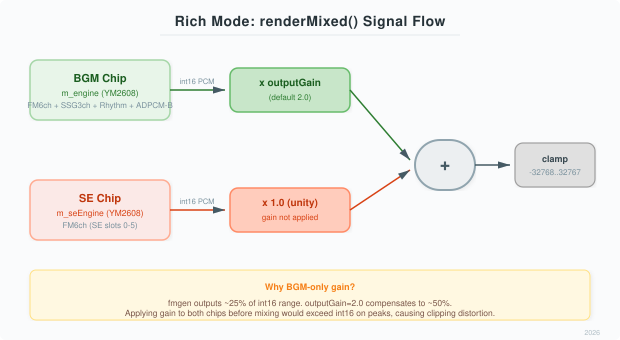

# libmucom88 組み込みガイド

アプリケーションにMMLのBGM、FM効果音、ADPCM-Bボイスを組み込む手順です。
MMLの解析だけを試す場合は [README](../README.md#最初の実行mmlを解析する) を参照してください。
型とメソッドの詳細は [APIリファレンス](api_reference.md) にまとめています。

## 構成と責任範囲


libmucom88はMMLをイベント列へ変換し、演奏時刻に応じて `IFmEngine` を呼び出します。
利用側はバックエンド、音声デバイス、ファイルI/O、スレッド間の受け渡しを用意します。
`MmlEngine` はOPNAの11トラック制御を行います。`#mode` のメタデータや `ChipMode` の列挙子だけで
OPM・OPNB・OPNの再生経路へ自動的に切り替わるわけではありません。

## ビルドに追加する

利用側リポジトリでlibmucom88を取得します。

```bash
git submodule add https://github.com/takamori-tech/libmucom88.git vendor/libmucom88
```

既存のCMakeプロジェクトでアプリケーションターゲットへリンクします。

```cmake
add_subdirectory(vendor/libmucom88)
target_link_libraries(your_app PRIVATE mucom88::mucom88)
```

コアに必要なのはC++17です。付属CMakeの最低バージョンは3.21。
ツール・テストの構成を確実に指定するには、`LIBMUCOM88_BUILD_TOOLS` と
`LIBMUCOM88_BUILD_TESTS` を明示します。通常の `add_subdirectory()` 利用では不要です。
インストール用パッケージ設定は提供していないため、`find_package(mucom88)` を前提にしません。

## IFmEngine の実装

既存エミュレータをラップして `IFmEngine` を実装するか、付属の `FmEngineYmfm` を使います。
必須メソッドの宣言例は [APIリファレンス](api_reference.md#ifmengine) を参照してください。
レジスタ書き込み・PCM生成・リセットのoverrideには `noexcept` が必要です。
任意のボイス・PCM機能にはfalse/no-opの既定実装があり、すべてのバックエンドで使えるとは限りません。

### 付属ymfmアダプタ

[ymfm本体](https://github.com/aaronsgiles/ymfm) は利用側が取得・ビルドします。
アダプタのヘッダーをincludeするだけではymfm本体のリンクは完了しません。
例として利用側の `vendor/ymfm` に取得した場合は、次を追加します。

```cmake
find_package(Threads REQUIRED)
add_library(ymfm_opna STATIC
    vendor/ymfm/src/ymfm_adpcm.cpp
    vendor/ymfm/src/ymfm_misc.cpp
    vendor/ymfm/src/ymfm_opn.cpp
    vendor/ymfm/src/ymfm_ssg.cpp
)
target_include_directories(ymfm_opna PUBLIC vendor/ymfm/src)
target_compile_features(ymfm_opna PUBLIC cxx_std_17)
target_link_libraries(your_app PRIVATE ymfm_opna Threads::Threads)
```

利用するymfmのrevisionはアプリケーション側で固定し、アダプタと一緒に検証してください。
初期化例は次のとおりです。

```cpp
#include <mucom88/mml_engine.hpp>
#include <mucom88/ymfm_engine.hpp>

void prepareYmfm(FmEngineYmfm& chip, MmlEngine& engine)
{
    chip.setDacModel(true);
    chip.setFidelity(FmEngineYmfm::FIDELITY_HIGH);
    chip.init(44100);
    engine.init(&chip, 44100, FmEngineYmfm::CHIP_CLOCK);
}
```

OPNA固定、`CHIP_CLOCK=7987200`、DACモデル有効・`FIDELITY_HIGH` が既定です。
`setFidelity()` は `init()` 前に行います。後から `MmlEngine::setChipClock()` を呼んでも
このアダプタの実クロックは変わりません。

このアダプタはレジスタ書き込み・生成・リセット等でmutexを取得します。
ボイス開始・終了ではADPCM-B RAMの初期化・コピーも行い、状況により確保が発生します。
厳しい実時間制約のある音声コールバックでは、その呼び出し経路を含めて評価してください。
事前ロードや `noexcept` だけで待機・確保・大きなコピーがなくなるわけではありません。

## BGMを準備して再生する

次のクラスは、利用側から初期化前の `IFmEngine` を受け取る最小のラッパーです。
すべての操作を直列化し、バックエンドをこのオブジェクトより長く生存させます。
`prepare()` と `load()` は音声コールバック外で、レンダリングを停止して呼びます。

```cpp
#include <cstdint>
#include <string>
#include <mucom88/mml_engine.hpp>

class MmlPlayer {
public:
    explicit MmlPlayer(IFmEngine& chip) : chip_(chip) {}

    void prepare(uint32_t sampleRate)
    {
        // sampleRateは実際のデバイスと同じ正の値。
        chip_.init(sampleRate);
        engine_.init(&chip_, sampleRate);
    }

    bool load(const std::string& text, const std::string& voicePath = {})
    {
        engine_.stop();
        MmlParser parser;
        if (!voicePath.empty() && !parser.loadVoiceDat(voicePath))
            return false;
        const auto song = parser.parse(text);
        engine_.loadFromParseResult(song);
        engine_.setLoop(false);
        return true; // 音色ロードの判定。MMLの構文検証結果ではない。
    }

    void play() noexcept { engine_.play(); }
    void stop() noexcept { engine_.stop(); }

    void render(int16_t* out, uint32_t frames) noexcept
    {
        // outは利用側が確保したframes * 2要素のバッファ。
        engine_.renderMixed(out, frames);
    }

private:
    IFmEngine& chip_;
    MmlEngine engine_;
};
```

`loadFromParseResult()` は全トラックを置き換え、音色を追加・上書きします。
前の曲の音色マップ全体を消す操作ではないため、曲ごとの音色を完全分離する場合は
レンダリングを停止してプレイヤーを作り直すなど、利用側でライフサイクルを管理します。
解析結果の `L` に従う場合は、例の `setLoop(false)` を省きます。

最初の音出しには `load("D T120 @0 o4 l4 v12 cdefgab>c\n")` を使えます。
SSGは `@0` などの内蔵プリセット、または `E` によるエンベロープ指定が必要です。
現行実装の初期エンベロープ値は0なので、音符と `v` だけでは振幅が出ません。

`renderMixed()` は演奏時刻、ボイスタイマー、SEシーケンス、PCM生成、出力ミックスを進めます。
同じブロックに `advance()`、`tickVoiceTimer()`、バックエンドの `generateInterleaved()` を追加しないでください。
出力は符号付き16bitのL/Rインターリーブ。float等への変換、左右別バッファへのコピーは利用側で行います。
`isPlaying()` がfalseでも残響やSE・ボイスの状態と一致するとは限らず、単なる無音判定には使えません。

## 音色・リズム・PCMをロードする

| データ | 呼び出し先 | 時点 |
| --- | --- | --- |
| MML内のFM音色 | `MmlParser::parse()` → `loadFromParseResult()` | 楽曲準備 |
| 外部 `voice.dat` | `MmlParser::loadVoiceDat()` | 解析前 |
| ADPCM-AリズムROM | `IFmEngine::loadAdpcmRom()` / `loadAdpcmRomFromMemory()` | バックエンド初期化後、再生前 |
| 楽曲の `mucompcm.bin` | `MmlEngine` のPCMテーブル解析＋バックエンドのADPCM-B転送 | 再生前 |
| ボイステーブル | 対応バックエンドの `loadVoiceTable()` 等 | 再生前 |

`#voice` / `#pcm` の指定だけではロードされません。利用側がパスを解決して読み込みます。
リズムROMをWAVから作る場合は [READMEのdrumkit_gen例](../README.md#wavからリズムromを作る) を参照してください。

### mucompcm.bin

先頭0x400バイトは32バイト×32エントリのテーブル、以降はADPCM-Bデータです。
現行テーブル解析はエントリ先頭の名前有無、26–27バイトのparam、28–29バイトの開始値、
30–31バイトの長さを読み、終了値を `start + (length >> 2)` で計算します。
一般のPCM WAVをそのまま渡す形式ではありません。

便利な `loadPcmBinary()` / `loadPcmBinaryFile()` は内部の転送失敗を戻り値へ反映しません。
バックエンドへの転送結果まで確認する場合は、初期化済みのエンジンと同じバックエンドへ個別に渡します。

```cpp
#include <cstddef>
#include <cstdint>
#include <mucom88/mml_engine.hpp>

bool loadSongPcm(MmlEngine& engine, IFmEngine& chip,
                 const uint8_t* data, size_t size)
{
    constexpr size_t headerSize = 0x400;
    if (data == nullptr || size <= headerSize)
        return false;
    if (!engine.loadPcmData(data, size))
        return false;
    return chip.loadPcmDataToAdpcmB(data + headerSize, size - headerSize);
}
```

これはファイル全体や各サンプル範囲の厳密な検証ではありません。
失敗した場合は再生を開始せず、データと対応バックエンドを確認します。

## ボイスとダッキング


ボイス機能を実装したバックエンドへテーブルを読み、結果を確認してから再生します。
`IFmEngine` の既定実装はボイスを生成しません。無効なIDでもシーケンサー側の優先制御を開始し得るため、
利用側で有効なボイスIDを管理してください。

```cpp
#include <string>
#include <mucom88/mml_engine.hpp>

bool prepareVoices(MmlEngine& engine, const std::string& path)
{
    if (!engine.loadVoiceTable(path))
        return false;
    engine.setVoiceVolume(0.9f);
    engine.setDucking(20, 0.15f);
    return true;
}

// 準備済みの有効なIDを、レンダリングと直列化して呼ぶ。
void startVoice(MmlEngine& engine, int id) noexcept
{
    engine.playVoice(id);
}
```

優先状態は `Idle → Playing → Releasing → Idle`。復帰時間等の条件によりReleasingを通らない場合もあります。
PlayingとReleasingの間はBGMのKトラック処理を抑制します。ボイス終了とK処理再開は同じ時点とは限りません。
`renderMixed()` がタイマーと復帰を進めるので、別途タイマーを更新する必要はありません。
中断は `stopVoice()`、ADPCM-B全体への停止指示は `stopAdpcmB()` を使います。

ボイスの開始音量はマスターとボイスの減衰を合算して算出します。
再生途中の `setVoiceVolume()` で、そのボイスの音量が即時更新される保証はありません。
ボイスを含んだ最終PCM全体へゲインを掛けるとボイスも下がるため、BGMだけを下げる用途では
`setDucking()` や `setBgmVolume()` を使います。

### 付属ymfmのボイステーブル

`FmEngineYmfm` は先頭のuint32の件数（1–64）、続く件数分のuint32 offset/size、
ADPCM-Bデータを読みます。offsetはファイル先頭基準のバイト位置です。
整数を `memcpy` で読み取る実装なので、任意エンディアンへ自動変換する形式ではありません。
現行アダプタは16kHz相当のdelta-Nと残り時間計算を使用し、可変レートの情報は保持しません。
ローダーは全エントリの範囲を厳密に検査しないため、件数・offset・size・RAM容量の整合したデータを渡します。
この形式は `IFmEngine` 全実装の共通ファイル仕様ではありません。

## 音量とフェード


`setMasterVolume()`、`setBgmVolume()`、`setSeVolume()`、`setVoiceVolume()` の0–1は
レジスタ減衰へ変換する制御値です。0.8がPCM振幅80%になるという意味ではありません。
これらの設定は `play()` / `stop()` で保持されます。

フェードインは `play()` の後に無音状態を設定します。`play()` がフェードをリセットするためです。

```cpp
#include <mucom88/mml_engine.hpp>

void startWithFade(MmlEngine& engine)
{
    engine.play();
    engine.fadeOut(0.0f);
    engine.fadeIn(1.5f);
}

void finishWithFade(MmlEngine& engine)
{
    engine.fadeOut(2.0f, MmlEngine::FadeAction::Stop);
}
```

フェードは音声の進行とともに更新されます。別スレッドのループから `isFading()` を
無同期で読み続ける実装にはしないでください。
`FadeAction::StopAndReset` はBGM・Rich SEのチップをリセットするため、その停止範囲も考慮します。

## FM効果音

| モード | 構成 | BGMへの影響 |
| --- | --- | --- |
| Classic（既定） | BGMと同じチップのFMチャンネルを一時占有 | 占有パートはSEが優先される |
| Rich | 初期化済みの別 `IFmEngine` をSE用に渡す | BGMのFMチャンネルを占有しない |


```cpp
#include <mucom88/mml_engine.hpp>

void prepareRichSe(MmlEngine& engine, IFmEngine& seChip, uint32_t sampleRate)
{
    seChip.init(sampleRate); // BGM・出力デバイスと同じレート。
    engine.setSeMode(MmlEngine::SeMode::Rich, &seChip);
}

int startEffect(MmlEngine& engine, const FmPatch& patch) noexcept
{
    return engine.playSe(patch, 72, 12, 150); // 150ms後に自動停止。
}
```

返り値0–5はスロット、−1は割り当て失敗です。全6スロットが使用中の場合は既存のSEが置き換わり得ます。
`stopSe(slot)`、`stopAllSe()` で停止できます。`play()` / `stop()` も全SEを停止します。
Rich用チップは `MmlEngine` が使っている間、生存させます。

複数ノートには `playSeSequence()` と `MmlEngine::SeSequenceNote` を使います。
最大8ノートを内部へコピーし、通常の `renderMixed()` で進行します。
ピッチスイープは最大16フレームごとの更新と整数ノートへの丸めを伴います。

## 出力プリセットとミキシング



`MmlEngine` は既定で `ChipOutputProfile::Tuned` を使用します。
初期化時にバックエンドの `chipEngine()` に応じてSSG倍率、出力ゲイン、互換出力段を設定します。
数値は [APIリファレンスのプリセット表](api_reference.md#出力プリセット) と
[chip_output_tuning.hpp](../include/mucom88/chip_output_tuning.hpp) が参照先です。

`setOutputGain()` はBGMチップPCMへの倍率です。Classicでは同じチップのSE・ボイスも含まれます。
RichではSEチップを等倍で加算し、その合計へソフトリミッターを適用します。
Classicのgain=1はPCMコピー、gain≠1はソフトリミッター経由です。
`Native` はこの最終段や独立したDAC設定まで一括バイパスする指定ではありません。

パート別出力や多重チップのdouble合算には [Logical Stem Mixing](logical_stem_mixing.md) があります。
`IChipBackend` のstem経路を利用側が接続する機能で、付属ymfmアダプタや `renderMixed()` に自動追加されません。
`PostChipProcessor` も別途接続するfloat音声の後段処理です。バックエンド側のDAC・リミッターとの
重複処理を避けるため、適用順と目的を決めてから使います。

## スレッドと入力の管理

1. ファイルI/O、解析、ロード、エンジン交換はレンダリングを停止して行う。
2. 再生中の指示は利用側のキュー等で所有スレッドへ送り、エンジン操作を直列化する。
3. UI表示用の状態も同じ所有スレッドで取得し、安全に受け渡したスナップショットをUIが読む。
4. 停止・破棄ではコールバックが参照しなくなったことを確認してからエンジンやバックエンドを破棄する。

一部にatomicが使われていても、クラス全体の並行操作は保証されません。
バックエンド内のmutexを理由に、シーケンサーもスレッドセーフだと判断しないでください。
`parse()` には構文診断APIがなく、展開量全体の上限も提供していません。
外部からMMLを受け付ける場合は、利用側の用途に応じて入力サイズ・時間・リソースを制限します。

## 問題の切り分け

| 症状 | 確認すること |
| --- | --- |
| 音が出ない | トラックにイベントがあるか、`play()` 済みか、バックエンドとデバイスのレート・バッファ形式が一致するか |
| FM・リズム・PCMだけ出ない | 必要な音色・ROM・PCMと、バックエンドの対応・ロード結果 |
| 曲が速い／SE時間が短い | `renderMixed()` と別の時間更新・生成を重ねていないか |
| ボイス後にKパートが戻らない | 継続して `renderMixed()` を呼び、ダッキング復帰を進めているか |
| 音量や波形が比較結果と違う | バックエンド、Tuned/Native、SSG倍率、gain、DAC・リミッター、入力アセットを揃えたか |
| UI操作で不安定になる | getterを含む並行アクセスと、参照中オブジェクトの寿命 |

単体テストと楽曲比較の違いは [互換性と検証](Z80_vs_MmlEngine.md) を参照してください。
