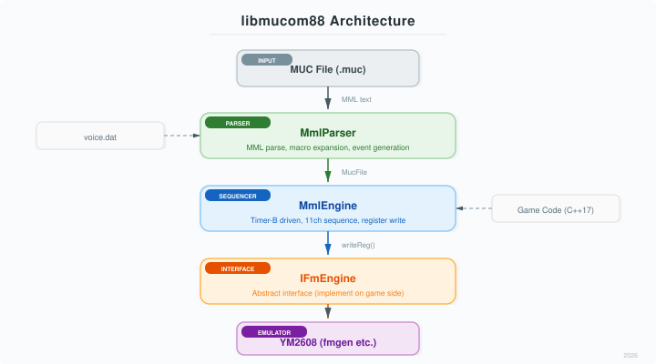
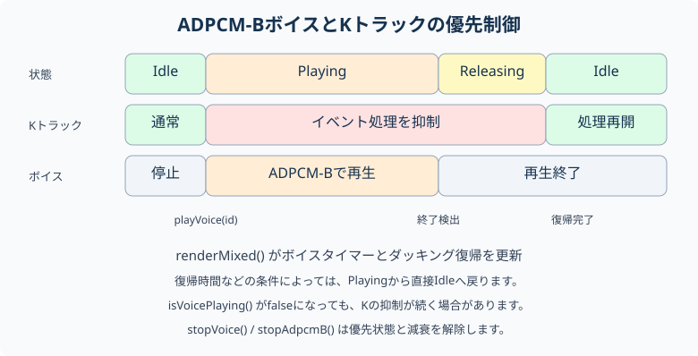
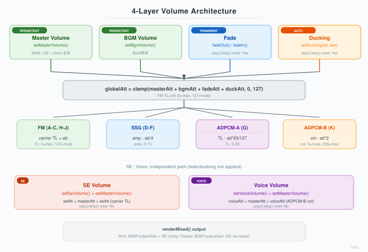
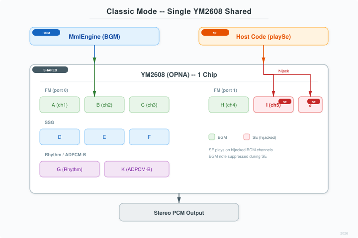
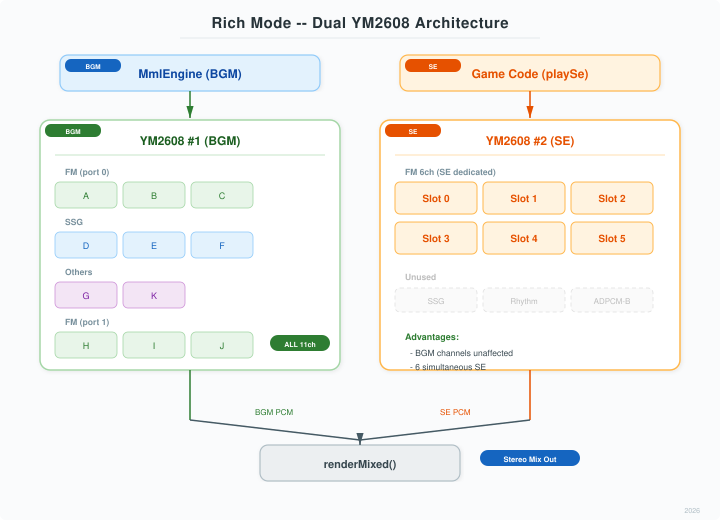

# libmucom88 ゲームプログラム組み込みガイド

MUCOM88互換のMMLパーサー＋シーケンサー＋ADPCM-Bボイス再生ライブラリ。
ゲームプログラムからYM2608(OPNA)でBGM再生・ボイス再生を行うための組み込み手順を説明する。

## 前提

- C++17 以上
- YM2608エミュレータ（fmgen）を自前で用意すること
- libmucom88 自体はヘッダーオンリー（外部依存なし）

## プロジェクトへの追加

```bash
git submodule add https://github.com/takamori-tech/libmucom88.git vendor/libmucom88
```

```cmake
target_include_directories(your_target PRIVATE vendor/libmucom88/include)
```

## アーキテクチャ



## ヘッダー一覧

| ヘッダー | 内容 |
|----------|------|
| `mucom88/fm_common.hpp` | FM音色定義（FmPatch）、周波数変換、voice.datパーサー |
| `mucom88/fm_engine_interface.hpp` | IFmEngine 抽象インターフェース |
| `mucom88/mml_parser.hpp` | MMLパーサー（MucFile構造体を出力） |
| `mucom88/mml_engine.hpp` | MMLシーケンサー（Timer-B駆動、11チャンネル制御） |

## IFmEngine の実装

ゲーム側で YM2608 エミュレータをラップして IFmEngine を実装する必要がある。

### 必須メソッド

```cpp
#include <mucom88/fm_engine_interface.hpp>

class MyFmEngine : public IFmEngine {
public:
    // 初期化（出力サンプルレート指定）
    void init(uint32_t sampleRate) override;

    // YM2608 レジスタ書き込み
    // port=0: FM ch1-3, SSG, リズム, ADPCM-B制御
    // port=1: FM ch4-6
    void writeReg(int port, uint8_t addr, uint8_t data) override;

    // ステレオPCM生成（インターリーブ L,R,L,R,...）
    void generateInterleaved(int16_t* buf, uint32_t frameCount) override;

    // チップリセット
    void reset() override;

    // ADPCM-A ROM ロード（リズム音源用、ym2608_adpcm_rom.bin）
    bool loadAdpcmRom(const std::string& path) override;
    bool loadAdpcmRomFromMemory(const uint8_t* data, size_t size) override;
    bool hasAdpcmRom() const override;

    // ADPCM-B ボイステーブル（ゲームボイス用）
    bool loadVoiceTable(const std::string& path) override;
    bool loadVoiceTableFromMemory(const uint8_t* data, size_t dataSize) override;
    bool hasVoiceTable() const override;
    void playVoice(int voiceId) override;
    void stopVoice() override;
    bool isVoicePlaying() const override;
    void tickVoiceTimer(uint32_t frameCount) override;
    void stopAdpcmB() override;
};
```

### ボイステーブル形式

`voice_table.bin` のバイナリ形式:

```
[num_voices: uint32]                          // ボイス数（最大64）
[offset: uint32, size: uint32] × num_voices   // 各ボイスの開始位置とサイズ
[ADPCM-Bデータ...]                            // 実データ（16kHz, 4bit ADPCM-B）
```

`playVoice(voiceId)` の実装では:
1. パンをミュート（ポップノイズ防止）
2. ADPCM-Bをリセット
3. 開始/終了アドレスを設定
4. delta-N = 0x49BA（16kHz再生）
5. レベル最大 + 再生開始
6. パン L+R を復元

`tickVoiceTimer(frameCount)` でボイス再生の残り時間を追跡し、完了を検出する。

## BGM再生の基本フロー

```cpp
#include <mucom88/mml_parser.hpp>
#include <mucom88/mml_engine.hpp>

// 1. IFmEngine実装のインスタンスを作成
MyFmEngine fmEngine;
fmEngine.init(44100);

// 2. MMLパース
MmlParser parser;
parser.loadVoiceDat("voice.dat");            // MUCOM88形式の音色ファイル
auto result = parser.parse(mucFileContent);  // MUCテキストをパース

// 3. MmlEngineセットアップ
MmlEngine engine;
engine.init(&fmEngine, 44100);

// 音色をエンジンに登録
for (auto& [no, patch] : result.patches)
    engine.setPatch(no, patch);

// 全音符クロック数を設定
engine.setWholeTick(result.wholeTick);

// チャンネルイベントをロード（A-K = 11チャンネル）
for (int ch = 0; ch < 11; ch++)
    engine.setEvents(ch, result.channelEvents[ch]);

// ループ設定
engine.setLoop(true);

// 4. 再生開始
engine.play();
```

## mucompcm.bin（ADPCM-Bサンプル）のロード

BGM中のKトラック（ADPCM-B楽器再生）で使用するPCMデータ:

```cpp
// mucompcm.bin を読み込み
std::ifstream ifs("mucompcm.bin", std::ios::binary);
std::vector<uint8_t> pcmData(
    std::istreambuf_iterator<char>(ifs),
    std::istreambuf_iterator<char>());

if (pcmData.size() > 0x400) {
    // fmgen の ADPCM-B バッファにデータ部分をロード
    fmEngine.loadPcmDataToAdpcmB(
        pcmData.data() + 0x400, pcmData.size() - 0x400);
    // MmlEngine に PCM テーブル（マルチサンプル情報）をロード
    engine.loadPcmData(pcmData.data(), pcmData.size());
}
```

mucompcm.bin の形式:
- ヘッダ 0x400 バイト（最大32エントリ × 32バイト/エントリ）
  - [0-15] 音色名、[28-29] 開始アドレス、[30-31] データ長（256バイト単位）
- ヘッダ以降: ADPCM-B生データ
- MMLの `@N` でプログラムチェンジ（サンプル切り替え）

## オーディオコールバック

16サンプル単位で advance + generateInterleaved を呼ぶのが最適。
OpenMUCOM88（Z80 VM）と同じ粒度でTimer-Bタイミングが一致する。

```cpp
// SDL2 オーディオコールバックの例
void audioCallback(void* userdata, uint8_t* stream, int len) {
    auto* bgm = static_cast<BgmPlayer*>(userdata);
    int16_t* out = reinterpret_cast<int16_t*>(stream);
    uint32_t frameCount = len / (2 * sizeof(int16_t));  // ステレオ

    uint32_t remaining = frameCount;
    uint32_t offset = 0;
    while (remaining > 0) {
        uint32_t n = std::min(remaining, (uint32_t)16);

        // MMLシーケンサーを進める（レジスタ書き込みが発生）
        engine.advance(n);

        // ボイスタイマー更新（ダッキングリリース処理を含む）
        // 重要: isVoicePlaying() の結果に関わらず毎フレーム呼ぶこと。
        // 条件付き呼び出しにするとボイス終了後のダッキングリリースが発火しない。
        engine.tickVoiceTimer(n);

        // YM2608エミュレータで音声生成
        int16_t buf[32];  // max 16 frames × 2ch
        fmEngine.generateInterleaved(buf, n);

        std::memcpy(out + offset * 2, buf, n * 2 * sizeof(int16_t));
        offset += n;
        remaining -= n;
    }
}
```

## ボイス再生（ADPCM-B）

ゲーム中のボイスコール（"Destroy them all!" 等）をBGM再生中に差し込む。
MmlEngineのボイス再生APIを使うと、BGMのKトラック（ADPCM-B）との排他制御が自動的に行われる。

### 動作の流れ



1. `playVoice(id)` を呼ぶ
   - BGMのKトラックが発音中であれば KEY_OFF で停止
   - `m_voiceOverride = true` でKトラックのイベント処理を抑制
   - IFmEngine経由でボイス再生を開始
2. ボイス再生中
   - BGMのKトラック（ch 10）の全イベント処理がスキップされる
   - FM/SSG/リズム等の他チャンネルは通常通り再生継続
3. ボイス再生終了（`tickVoiceTimer()` で検出）
   - `m_voiceOverride = false` に戻る
   - 次の advance() tick からKトラックのイベント処理が自動再開
   - BGMの次のADPCM-Bノートで adpcmbKeyOn() が呼ばれ、パン・ボリューム・ピッチが全て再設定される

### 使い方

```cpp
// ボイステーブルのロード（起動時に1回）
fmEngine.loadVoiceTable("voice_table.bin");

// ボイス再生（BGM再生中でも安全に呼べる）
engine.playVoice(0);   // voiceId=0 のボイスを再生

// ボイス終了検出
if (engine.isVoicePlaying()) {
    // まだ再生中
}

// 明示的に停止（ボイスを途中で打ち切る場合）
engine.stopVoice();
```

### ダッキング（BGM自動減衰）

`setDucking()` を設定すると、ボイス再生中にBGM全チャンネル（FM/SSG/ADPCM-A/ADPCM-B）の音量を自動的に下げる。
ボイス終了後は指定した時間をかけて徐々に復帰する。

```cpp
// ダッキング設定（初期化時に1回）
// attTarget: FM TL加算値（20≈-15dB）。SSGはatt/4で換算。
// releaseSec: ボイス終了後の復帰時間（秒）
engine.setDucking(20, 0.15f);

// あとは playVoice() を呼ぶだけで自動的にダッキングが動作する
engine.playVoice(0);
// → FM/SSG が即座に -15dB 減衰
// → ボイス終了後、0.15秒かけて元の音量に復帰
```

レジスタレベルで FM の TL（Total Level）、SSG の振幅、ADPCM-A の全体 TL、ADPCM-B のボリュームを操作する。
ボイス再生中は `recalcGlobalAtt()` のガードにより ADPCM-B レジスタ書き込みがスキップされ、
ボイスの音量は `playVoice()` で masterAtt のみ適用されるため、ボイスの聞き取りやすさが確保される。

ダッキングを無効にするには `setDucking(0)` を呼ぶ。

> **注意:** `tickVoiceTimer(frameCount)` はオーディオコールバック内で **毎フレーム無条件に** 呼ぶこと。
> `isVoicePlaying()` が false の場合でも呼び出しが必要。
> ボイス終了後のダッキングリリース遷移（Playing → Releasing → Idle）は
> `tickVoiceTimer()` 内で処理されるため、呼び出しを省略すると
> BGMの音量が減衰したまま復帰しなくなる。

### 手動ダッキング

自動ダッキングを使わず、出力バッファに直接ゲインを掛ける方法もある:

```cpp
float duckGain = engine.isVoicePlaying() ? 0.3f : 1.0f;
for (uint32_t i = 0; i < frameCount * 2; i++)
    buf[i] = (int16_t)(buf[i] * duckGain);
```

この方法はボイスを含む全出力に影響する点に注意。

## 音量制御



### マスターボリューム

ゲームのオプション画面等でBGM音量を調整する場合:

```cpp
// 初期化時または設定変更時
engine.setMasterVolume(0.8f);  // 80%

// ボイス再生時もマスターボリュームが自動適用される
engine.playVoice(0);  // ボイスも80%の音量で再生
```

マスターボリュームは `play()` / `stop()` でリセットされない（ゲーム設定として永続）。
ダッキングやフェードとは独立に動作し、全て加算的に適用される。

### フェードアウト/イン

ステージ終了時のBGMフェードアウト（手動停止）:

```cpp
// 2秒かけてフェードアウト
engine.fadeOut(2.0f);

// フェード完了待ち
while (engine.isFading()) {
    // オーディオコールバックでadvance()を継続
}

// BGM停止
engine.stop();
```

### フェードアウト完了時の自動停止（FadeAction）

`fadeOut()` の第2引数に `FadeAction` を指定すると、フェードアウト完了時に
自動的にBGM停止やチップリセットを実行できる。ゲームループ側でのフェード完了検出
ボイラープレートが不要になる。

```cpp
// 2秒かけてフェードアウト → 完了後に自動停止
engine.fadeOut(2.0f, MmlEngine::FadeAction::Stop);

// 2秒かけてフェードアウト → 完了後に自動停止 + チップリセット
// Richモード使用時はSEチップも含めてリセットされる
engine.fadeOut(2.0f, MmlEngine::FadeAction::StopAndReset);
```

フェードアウト完了後、`isFadeOutDone()` が `true` を返す。
次の `play()` 呼び出しで自動的にリセットされる。

```cpp
// フェードアウト完了検出（ゲームループ側）
if (engine.isFadeOutDone()) {
    // 次のBGMをロード・再生
    engine.loadFromParseResult(nextMuc);
    engine.play();  // isFadeOutDone() が自動リセットされる
}
```

| FadeAction | 動作 |
|------------|------|
| `None` | 何もしない（デフォルト、従来の `fadeOut(seconds)` と同一） |
| `Stop` | `stop()` を自動呼び出し。全音消音しBGMを停止 |
| `StopAndReset` | `stop()` + BGMチップとSEチップの `reset()`。Richモード時はSEチップの初期状態も再確立 |

フェード中にボイスを再生する場合、ボイスはマスターボリュームのみで再生される
（フェード減衰は適用されない）。

ステージ開始時のフェードイン:

```cpp
engine.fadeOut(0.0f);   // 即時無音（フェードアウト状態にする）
engine.play();
engine.fadeIn(1.5f);    // 1.5秒かけてマスターボリュームまで復帰
```

フェードを即座にキャンセルする場合:

```cpp
engine.resetFade();  // マスターボリュームに即時復帰
```

### 出力ゲイン

`renderMixed()` の最終段でPCMサンプルにゲインを掛ける。
fmgenの出力レベルがint16範囲の約25%のため、2.0倍のゲインで補正する用途等に使用:

```cpp
// fmgen出力レベル補正（初期化時に1回）
engine.setOutputGain(2.0f);  // 2.0倍 = +6dB

// renderMixed()内で自動的にゲイン適用+クリッピングされる
engine.renderMixed(out, frameCount);
```

出力ゲインは `play()` / `stop()` でリセットされない（ゲーム設定として永続）。
マスターボリューム・フェード・ダッキングとは独立に、最終PCM出力に乗算適用される。
デフォルト値: **1.0**（ゲインなし、現行動作と後方互換）。

## SEモード（Classic / Rich）

libmucom88のSE（効果音）再生には2つのモードがある。
ゲームの要件に応じてどちらかを選択する。`playSe()` APIは両モード共通で使用できる。

### Classicモード（デフォルト）

BGMと同一のYM2608チップでSEを再生する。BGMのFMチャンネルを一時的にハイジャックしてSE用に使用するため、SE再生中はそのチャンネルのBGMが抑制される。アーケードゲーム（1チップ構成）と同じ方式。



**特徴:**
- 追加のYM2608インスタンス不要（軽量）
- SE再生中、ハイジャックされたチャンネルのBGMが一時的に消える
- ノートオフ中のチャンネルを優先選択することで影響を最小化

### Richモード

SE専用の2台目のYM2608チップ（IFmEngine）を使用する。BGMチップとSEチップが完全に独立しているため、BGMの発音に一切影響を与えずにSEを同時再生できる。



**特徴:**
- BGMチャンネルへの影響なし（全11chがBGM専用）
- FM 6ch分のSE同時発音が可能
- 追加のYM2608エミュレータインスタンスが必要（CPU負荷増）
- `renderMixed()` でBGM+SEの出力を自動ミキシング

### モード比較

| | Classic | Rich |
|---|---------|------|
| チップ数 | 1（共有） | 2（BGM+SE） |
| BGMへの影響 | SE再生中チャンネル抑制 | なし |
| SE同時発音数 | 最大6（BGMチャンネル依存） | 最大6（SE専用） |
| CPU負荷 | 低い | YM2608 x2分 |
| セットアップ | 不要（デフォルト） | `setSeMode(Rich, &seEngine)` |
| オーディオ出力 | 通常のadvance()+generate() | `renderMixed()` 推奨 |

## チャンネルハイジャック（効果音割り込み）

BGM再生中のFM/SSGチャンネルをSE（効果音）再生に一時的に奪う機能。
アーケードSTGのように、BGMとSEが同一YM2608チップを共有する場合に使用する。
Classicモードの内部実装で使用されるが、直接呼び出すこともできる。

```cpp
// SE再生開始: FM ch6（パートJ、ch=9）をハイジャック
engine.hijackChannel(9);
// → BGMのJ partはKEY_OFFされ、以降のレジスタ書き込みが抑制される
// → 外部コードがIFmEngine::writeReg()で直接制御可能

// SE用のレジスタ操作
fmEngine->writeReg(1, 0xA4 + 2, ...);  // FM ch6 周波数
fmEngine->writeReg(1, 0x40 + 12, ...); // FM ch6 TL
fmEngine->writeReg(0, 0x28, 0xF6);     // FM ch6 KEY ON

// SE終了: チャンネルをBGMに返却
engine.releaseChannel(9);
// → BGMの音色・音量・PANが自動復元される
```

**動作仕様:**
- ハイジャック中、BGMのイベント進行は継続（曲の再生位置を追跡）するが発音しない
- `releaseChannel()` でBGMの現在の音色・音量・PANをレジスタに復元して再開
- 対象: FM ch1-6 (A-C, H-J) および SSG ch1-3 (D-F)
- Rhythm (G) と ADPCM-B (K) は対象外（既存のボイス再生APIで制御）

**SE用チャンネル選択の指針:**
```cpp
// 最もアクティブでないFMチャンネルを選択する例
int bestCh = -1;
for (int ch : {9, 8, 7, 2, 1, 0}) {  // J,I,H,C,B,A の優先順
    if (!engine.chNoteOn(ch)) {
        bestCh = ch;
        break;
    }
}
if (bestCh >= 0) engine.hijackChannel(bestCh);
```

## 効果音再生（統合SE API / Richモード）

`playSe()` を使うと、Classic/Richどちらのモードでも同じコードでSE再生ができる。
Classicモードでは内部でhijackChannelを使用し、RichモードではSE専用チップのFM 6chに割り当てる。

### Richモードのセットアップ

```cpp
// SE専用チップの作成・初期化（BGMチップと同じクラス）
MyFmEngine seEngine;
seEngine.init(44100);

// Richモードに切り替え（デフォルトはClassic）
engine.setSeMode(MmlEngine::SeMode::Rich, &seEngine);
```

### SE発音

```cpp
// SE用の音色を定義（voice.datから読み込みまたは直接構築）
FmPatch explosionPatch = ...;  // @番号ではなくFmPatch実体を渡す

// SE発音（両モード共通API）
// 戻り値: SEスロット番号(0-5)、-1=割り当て失敗
int slot = engine.playSe(explosionPatch, 60);          // C4, velocity=15
int slot2 = engine.playSe(laserPatch, 72, 12);         // C5, velocity=12
int slot3 = engine.playSe(hitPatch, 48, 15, 200);      // C3, 200ms後に自動停止

// SE再生中のピッチ変更（F-Number更新のみ、パッチ再適用なし）
engine.setSeFrequency(slot, 48);   // ノート番号を変更

// SE停止（手動）
engine.stopSe(slot);

// 全SE停止
engine.stopAllSe();

// SE状態確認
bool active = engine.isSeActive(slot);
int count = engine.activeSeCount();
```

### オーディオコールバック（renderMixed使用）

Richモードでは `renderMixed()` を使うと、BGMチップとSEチップの出力が自動的にミキシングされる。
Classicモードでも使用可能（SEチップ出力なし）。

```cpp
void audioCallback(void* userdata, uint8_t* stream, int len) {
    auto* bgm = static_cast<BgmPlayer*>(userdata);
    int16_t* out = reinterpret_cast<int16_t*>(stream);
    uint32_t frameCount = len / (2 * sizeof(int16_t));

    // BGM + SE を一括レンダリング（16サンプル単位で内部処理）
    engine.renderMixed(out, frameCount);
}
```

### ボイスアロケーション

- Richモード: SEチップのFM 6chに最大6音同時発音
- 全スロット使用中に `playSe()` を呼ぶと、最も古いSEを停止して再割り当て（oldest策略）
- Classicモード: BGMのFMチャンネル（J,I,H,C,B,A優先）をhijack。ノートオフ中のチャンネルを優先選択

### SEピッチスイープ

`setSeFrequency()` を使うと、再生中のSEスロットのピッチをパッチ再適用なしに変更できる。
`stopSe()` → `playSe()` の繰り返しに比べ、レジスタ書き込みが30+回→2回に削減される。

```cpp
// ショット音のピッチ下降（MIDI note 96→60 を毎フレーム更新）
int slot = engine.playSe(shotPatch, 96, 15, 104);
// オーディオコールバック内で毎フレーム呼ぶ
engine.setSeFrequency(slot, currentNote);
```

### SEシーケンス再生（マルチノート + 自動ピッチスイープ）

`playSeSequence()` を使うと、複数ノート + ピッチスイープを1つのSEスロットで自動再生できる。
ゲーム側でフレーム毎にピッチ更新する必要がなく、SEの定義をデータドリブンにできる。

```cpp
// SEシーケンスの定義（最大8ノート）
MmlEngine::SeSequenceNote notes[] = {
    {96, 60, 100},   // 100ms: ノート96→60へピッチスイープ
    {48, -1, 200},   // 200ms: ノート48で固定（スイープなし）
    {60, 72, 150},   // 150ms: ノート60→72へピッチスイープ
};

// SEシーケンス発音（playSe()と同じスロット管理）
int slot = engine.playSeSequence(laserPatch, notes, 3, 15);
// → 100ms後に自動的にノート48へ遷移（パッチ再適用なし）
// → さらに200ms後にノート60→72のスイープ開始
// → 全ノート終了で自動停止

// 途中停止も可能
engine.stopSe(slot);
```

**動作詳細:**
- 各ノートの `durationMs` 経過後、自動的に次のノートへ遷移（レガート: 周波数変更 + KEY_ONのみ、パッチ再適用なし）
- `endNote != -1` のノートでは、duration中にstartNote→endNoteへ線形ピッチ補間（サンプル精度で毎フレーム更新）
- `endNote == -1` のノートでは、startNoteの固定ピッチで再生
- 全ノート消費で通常のSE停止処理
- Classic/Richモード両対応、音量制御（マスター + SE）も `playSe()` と同じ

**使用例: レーザー音**
```cpp
// ピッチ下降→維持→上昇の3フェーズレーザー
MmlEngine::SeSequenceNote laser[] = {
    {96, 72, 50},    // 50ms: 高→中へ急降下
    {72, -1, 100},   // 100ms: 中域で維持
    {72, 84, 80},    // 80ms: 中→高へ上昇
};
engine.playSeSequence(laserPatch, laser, 3);
```

### SE音量

- マスターボリューム（`setMasterVolume()`）はSEにも適用される
- SEボリューム（`setSeVolume()`）はSE専用の独立音量。マスターボリュームと加算適用
- フェード（`fadeOut()`/`fadeIn()`）はBGM専用。SEには影響しない
- ダッキング（`setDucking()`）はBGM専用。SEには影響しない

```cpp
// ゲームオプション画面での音量設定例
engine.setMasterVolume(0.8f);  // BGM+SE共通マスター 80%
engine.setSeVolume(0.6f);      // SE音量 60%（BGMより控えめ）
```

## チャンネル状態の取得（UI表示用）

```cpp
// チャンネル番号: 0-2=FM(A-C), 3-5=SSG(D-F), 6=Rhythm(G), 7-9=FM(H-J), 10=ADPCM-B(K)

bool noteOn   = engine.chNoteOn(ch);      // ノートオン中か
int  note     = engine.chNote(ch);         // MIDIノート番号
int  volume   = engine.chVolume(ch);       // 音量（FM: 0-15, SSG: 0-15）
int  pan      = engine.chPan(ch);          // パン（1=L, 2=R, 3=L+R）
int  reverb   = engine.chReverb(ch);       // リバーブ値（Rコマンド、FM専用）
uint32_t cnt  = engine.chNoteOnCount(ch);  // noteOnカウンター（UIアクティビティ検出）

bool playing  = engine.isPlaying();
uint32_t tick = engine.globalTick();
int  tempo    = engine.globalTempo();

// チャンネル種別判定
bool fm    = MmlEngine::isFM(ch);       // 0-2, 7-9
bool ssg   = MmlEngine::isSSG(ch);      // 3-5
bool rhythm = MmlEngine::isRhythm(ch);  // 6
bool adpcmb = MmlEngine::isADPCMB(ch);  // 10
```

## ループ制御

```cpp
// ループ ON/OFF
engine.setLoop(true);   // L コマンド位置に戻ってループ再生
engine.setLoop(false);  // 曲末で停止

// ループ情報取得
uint32_t endTick  = engine.commonEndTick();     // 全チャンネルの最大endTick
uint32_t loopTick = engine.loopTickOffset();     // ループ開始位置
int loopCnt       = engine.loopCount();          // 現在のループ回数

// フェードアウトの実装例
// ループ2周目以降でグローバル減衰を徐々に増加
if (engine.loopCount() >= 2) {
    int att = std::min((engine.loopCount() - 1) * 5, 30);
    engine.setGlobalAttenuation(att);
}
```

## 曲メタデータ

```cpp
MmlParser parser;
auto result = parser.parse(mucText);

result.title;       // #title ディレクティブ
result.composer;    // #composer ディレクティブ
result.voiceFile;   // #voice ディレクティブ（voice.datファイル名）
result.pcmFile;     // #pcm ディレクティブ（mucompcm.binファイル名）
result.chipMode;    // ChipMode::OPNA / OPM / OPNB
result.wholeTick;   // C コマンド（全音符クロック数、デフォルト128）
```

## BgmPlayer 実装例

CLAUDIUSプロジェクトの `bgm_player.hpp` を参考にした最小実装:

```cpp
#include <mucom88/mml_parser.hpp>
#include <mucom88/mml_engine.hpp>
#include "my_fm_engine.hpp"  // IFmEngine 実装

class BgmPlayer {
public:
    void init(uint32_t sampleRate) {
        m_sampleRate = sampleRate;
        m_fmEngine.init(sampleRate);
        m_mmlEngine.init(&m_fmEngine, sampleRate);
    }

    bool loadMuc(const std::string& mucText,
                 const std::string& voiceDatPath = {}) {
        MmlParser parser;
        if (!voiceDatPath.empty())
            parser.loadVoiceDat(voiceDatPath);
        m_result = parser.parse(mucText);

        m_mmlEngine.init(&m_fmEngine, m_sampleRate);
        for (auto& [no, patch] : m_result.patches)
            m_mmlEngine.setPatch(no, patch);
        m_mmlEngine.setWholeTick(m_result.wholeTick);
        for (int ch = 0; ch < 11; ch++)
            m_mmlEngine.setEvents(ch, m_result.channelEvents[ch]);
        return true;
    }

    void play()    { m_mmlEngine.setLoop(m_loop); m_mmlEngine.play(); }
    void stop()    { m_mmlEngine.stop(); m_mmlEngine.stopAdpcmB(); }
    void pause()   { m_mmlEngine.pause(); }
    void resume()  { m_mmlEngine.resume(); }
    bool isPlaying() const { return m_mmlEngine.isPlaying(); }
    void setLoop(bool l) { m_loop = l; m_mmlEngine.setLoop(l); }

    // 16サンプル単位でadvance+generate（OpenMUCOM88互換タイミング）
    void render(int16_t* out, uint32_t frameCount) {
        uint32_t remaining = frameCount;
        uint32_t offset = 0;
        while (remaining > 0) {
            uint32_t n = std::min(remaining, (uint32_t)16);
            m_mmlEngine.advance(n);
            int16_t buf[32];
            m_fmEngine.generateInterleaved(buf, n);
            std::memcpy(out + offset * 2, buf, n * 2 * sizeof(int16_t));
            offset += n;
            remaining -= n;
        }
    }

    // ボイス再生
    void playVoice(int id)  { m_mmlEngine.playVoice(id); }
    void stopVoice()        { m_mmlEngine.stopVoice(); }
    bool isVoicePlaying() const { return m_mmlEngine.isVoicePlaying(); }

private:
    MyFmEngine m_fmEngine;
    MmlEngine  m_mmlEngine;
    MmlParser::MucFile m_result;
    uint32_t m_sampleRate = 44100;
    bool m_loop = true;
};
```

## 注意事項

### Timer-Bと16サンプル粒度
`advance()` は内部で16サンプル単位に分割して処理する。
これはPC-8801実機のYM2608 Timer-B割り込みタイミングと一致させるため。
16の倍数でないframeCountを渡しても正しく動作する。

### スレッドセーフティ
MmlEngine はスレッドセーフではない。`advance()` と `playVoice()` 等は
同一スレッド（オーディオスレッド）から呼ぶこと。
UIスレッドからの状態取得（`chNoteOn()` 等）はアトミックではないが、
表示用途であれば実用上問題ない。

### チップクロック
デフォルトは 7,987,200 Hz（PC-8801 NTSC標準）。

`MmlEngine::init()` の第3引数で指定できる。
SSGの音程計算に影響する（Issue #22）。

### MUCOM88 チャンネル構成
| チャンネル | MML | 種別 | ポート |
|-----------|-----|------|--------|
| 0 (A) | FM ch1 | FM | port 0 |
| 1 (B) | FM ch2 | FM | port 0 |
| 2 (C) | FM ch3 | FM | port 0 |
| 3 (D) | SSG ch1 | PSG矩形波 | port 0 |
| 4 (E) | SSG ch2 | PSG矩形波 | port 0 |
| 5 (F) | SSG ch3 | PSG矩形波 | port 0 |
| 6 (G) | Rhythm | ADPCM-A (BD/SD/CY/HH/TM/RS) | port 0 |
| 7 (H) | FM ch4 | FM | port 1 |
| 8 (I) | FM ch5 | FM | port 1 |
| 9 (J) | FM ch6 | FM | port 1 |
| 10 (K) | ADPCM-B | 音程付きPCM | port 1 |
