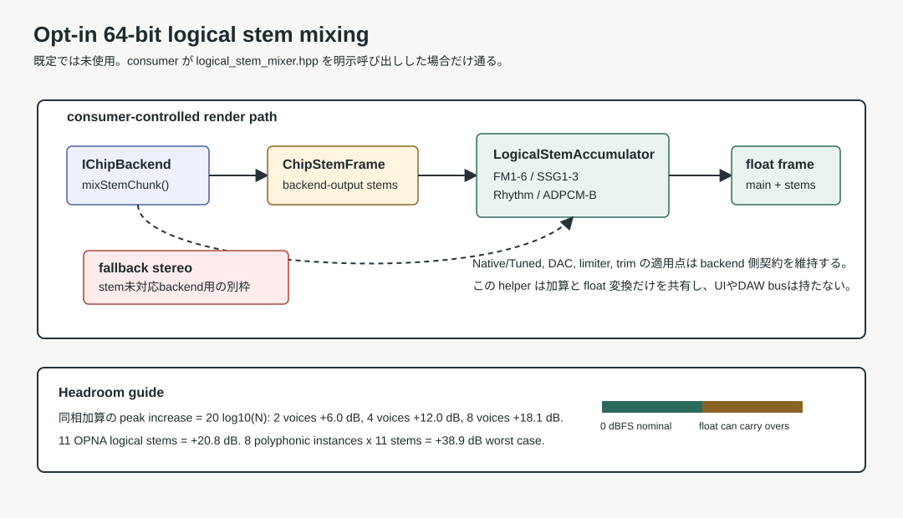

# Logical Stem Mixing

`logical_stem_mixer.hpp` は、バックエンドが出すパート別PCMをdoubleで合算し、floatへ変換する補助機能です。
エミュレータ内部の演算をfloatへ変える機能ではありません。
通常の `MmlEngine::renderMixed()` / `IFmEngine` 経路へ自動接続されず、利用側が明示的に呼び出します。



## 入力と出力

入力の `ChipStemFrame` はFM×6、SSG×3、Rhythm、ADPCM-B、全体mainを持つint32のステレオフレームです。
`IChipBackend::mixStemChunk()` が対応している場合に取得できます。既定実装は `false` で、
付属 `FmEngineYmfm` は別の `IFmEngine` を実装するため、このAPIを持ちません。

`LogicalStemAccumulator::addStem()` は**入力mainを使いません**。
各パートを合算し、出力mainをパート＋fallbackから再構成します。
`addFallbackStereo()` は分離できない別音源等の全体ステレオを加えるための入口です。
同じ音源のパートと全体ステレオを両方足すと二重計上になります。

## 1フレームの合算例

この例の2入力は、同じ時刻に対応する別インスタンスのフレームです。
バックエンドの生成処理とバスへの配線は利用側で実装します。

```cpp
#include <mucom88/logical_stem_mixer.hpp>

LogicalStemFloatFrame mixFrame(const ChipStemFrame& first,
                               const ChipStemFrame& second)
{
    LogicalStemAccumulator acc; // 出力フレームごとに初期化。
    acc.addStem(first);
    acc.addStem(second, 0.5);

    LogicalStemMixOptions options;
    options.enableDoubleStemSumming = true;
    options.outputScale = 1.0 / 32768.0;
    options.masterGain = 1.0;

    LogicalStemFloatFrame out;
    if (!writeLogicalStemFloatFrame(acc, options, out))
        clearLogicalStemFloatFrame(out);
    return out;
}
```

同じaccumulatorを再利用する場合は、次の出力フレームの前に `clear()` します。
ブロック全体を一つのaccumulatorへ足すと、時間方向に混ぜた値になってしまいます。

`LogicalStemMixOptions::enableDoubleStemSumming` の既定は `false`。
無効時の `writeLogicalStemFloatFrame()` は `false` を返し、出力を書き換えません。
前回の出力が自動でゼロになるとは限りません。

出力 `LogicalStemFloatFrame` はfloatの `main[2]`, `fm[6][2]`, `ssg[3][2]`,
`rhythm[2]`, `adpcmB[2]`, `fallback[2]` を持ちます。
いずれにも `outputScale * masterGain` が掛かります。

## バックエンドとの接続

- 対応チップとパート分離範囲を確認する。固定の配列形状だけで全チップの全パートを表せるとは限りません。
- バックエンドの生成は同じ時刻につき一度だけ行う。stem取得失敗後に通常mixを呼ぶ場合も、
  失敗した呼び出しでチップ時間が進んでいないか、具体実装の契約を確認します。
- `mixChunk()` の加算先int32バッファはゼロ初期化する。
- Native/Tuned、較正、SSGバランス、DACなどの適用位置を揃える。このヘルパーはそれらを適用しません。

各stemに別々の非線形リミッターを掛けた和と、全体へ一度掛けた結果は一般に一致しません。
stemの和がバックエンドの `main` と同じになる保証は、このヘルパーにはありません。

## ヘッドルーム

同じ振幅・同じ位相の信号をN個加算すると、ピークは `20 * log10(N)` dB増えます。

| 信号数 | ピーク増加 |
| ---: | ---: |
| 2 | +6.0dB |
| 4 | +12.0dB |
| 8 | +18.1dB |
| 11 | +20.8dB |

doubleでの合算は途中の整数クリップや丸めを避けますが、最終音量の調整は行いません。
出力floatは±1を超え得ます。整数PCM・デバイス出力への変換前に、利用側でレベルを管理します。
UI、DAWバス、保存状態、最終リミッターは利用側の責務です。

実装は [logical_stem_mixer.hpp](../include/mucom88/logical_stem_mixer.hpp)、
検証例は [logical_stem_mixer.cpp](../tests/logical_stem_mixer.cpp) を参照してください。
